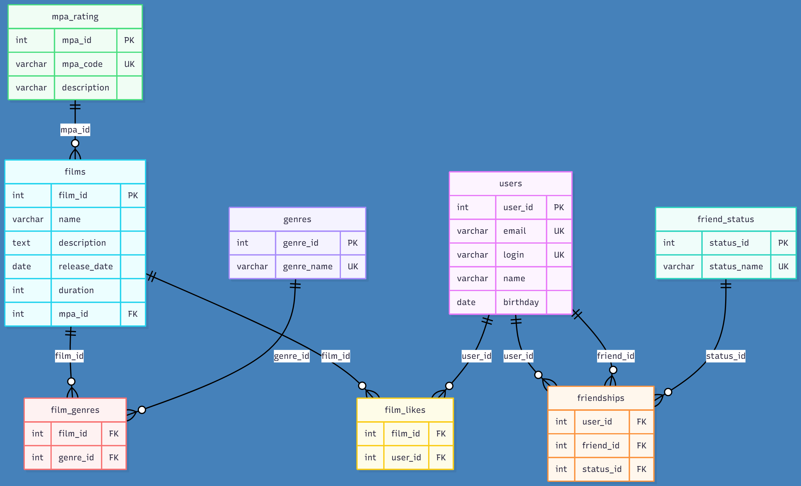

# java-filmorate
Template repository for Filmorate project.
## 🗄️ Схема базы данных 

## 📋 Описание таблиц

### Пользователи (users)
- **user_id** - уникальный идентификатор пользователя
- **pass** - пользовательский пароль
- **email** - электронная почта
- **login** - логин пользователя
- **name** - отображаемое имя
- **birthday** - дата рождения

### Фильмы (films) 
- **film_id** - уникальный идентификатор фильма
- **name** - название фильма
- **description** - описание
- **release_date** - дата выхода
- **duration** - продолжительность в минутах
- **rating_id** - ссылка на рейтинг MPA

### Друзья (friends)
- **user_id** - идентификатор пользователя
- **friend_id** - идентификатор друга
- **status** - статус дружбы (подтверждена/не подтверждена)

### Лайки (likes)
- **film_id** - идентификатор фильма
- **user_id** - идентификатор пользователя, поставившего лайк

### Жанры (genres)
- **genre_id** - идентификатор жанра
- **name** - название жанра

### Рейтинги MPA (mpa_ratings)
- **rating_id** - идентификатор рейтинга
- **name** - название рейтинга (G, PG, PG-13, R, NC-17)

### Фильмы-Жанры (film_genres)
- **film_id** - идентификатор фильма
- **genre_id** - идентификатор жанра

## 🔗 Связи между таблицами

- Пользователи могут дружить друг с другом (таблица friends)
- Пользователи могут ставить лайки фильмам (таблица likes)
- Каждый фильм относится к определенному рейтингу MPA
- Фильм может принадлежать к нескольким жанрам (связь многие-ко-многим через film_genres)
